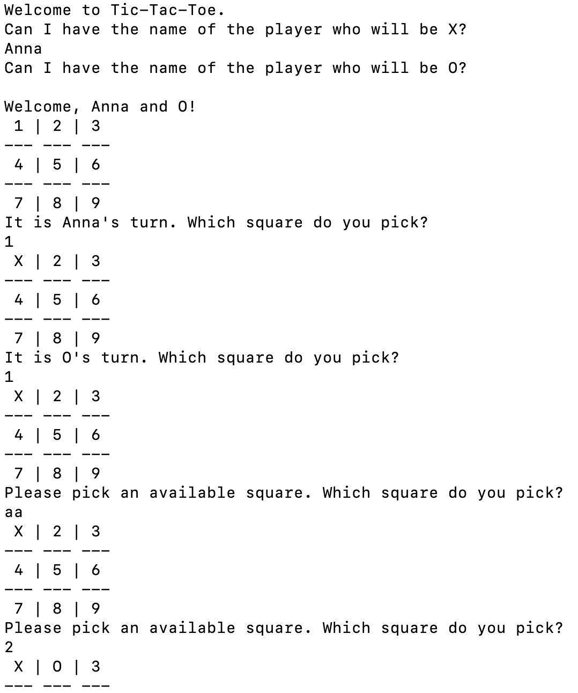

This is Anna Macdonald's implementation of The Odin Project's [Tic-Tac-Toe project](https://www.theodinproject.com/courses/ruby-programming/lessons/oop).

It is a simple command-line game between two human players. 

The following screenshot demonstrates how it handles several input-error types.

